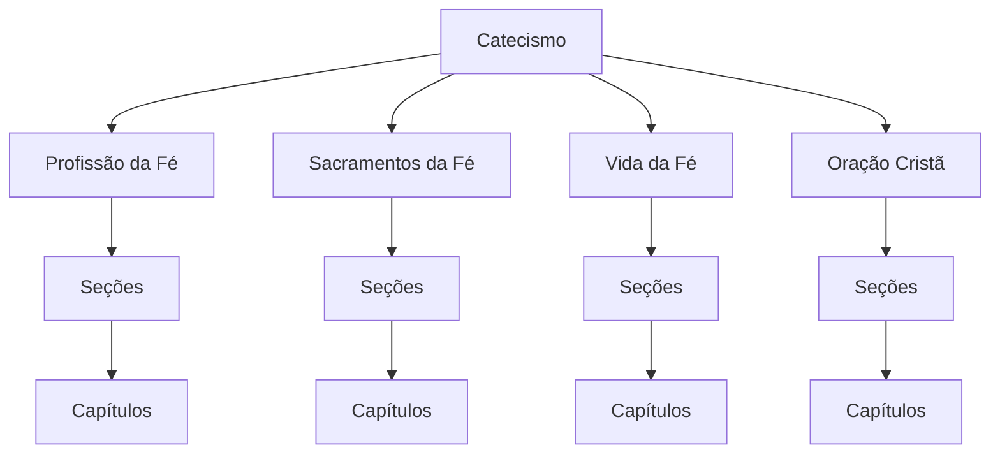

# A Estrutura do Catecismo

O catecismo está dividido em **`quatro partes`**. São elas:

- A profissão da fé;
- Os sacramentos da fé;
- A vida da fé;
- A oração cristã;

Cada **`parte`** do Catecismo é formada por **`seções`** e cada seção é dividida por
**`capítulos`**.

